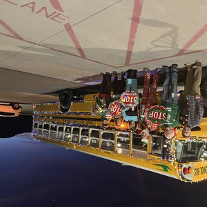
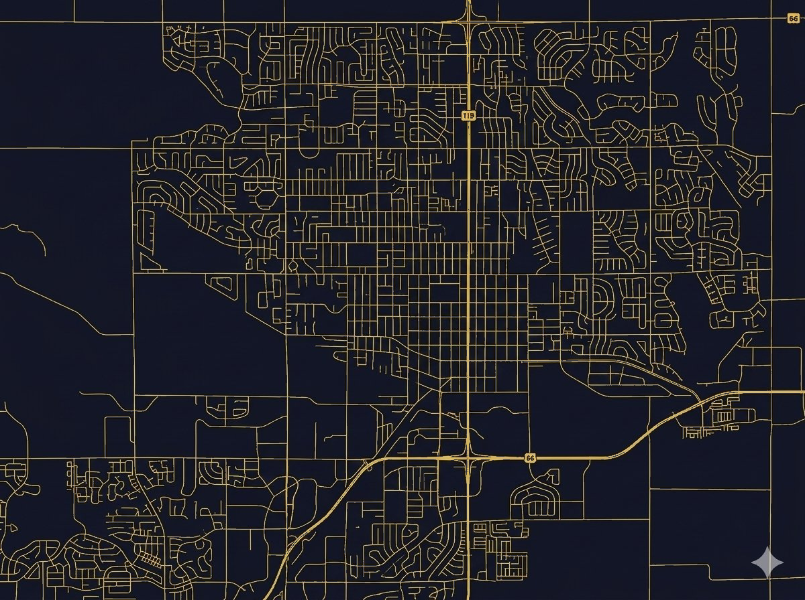

# WEBSITE_MAP.md

Comprehensive documentation of `/driver` subdirectory site architecture. Generated: 2026-05-18.

---

## 1. Repo Structure Overview

### Directory Tree (Relevant to `/driver` Site)

```
/driver/
├── index.html                          (Main entry point)
├── style.css                          (Global styles for index.html)
├── main.js                            (Global scripts for index.html)
├── hero.jpg                           (Hero section background)
├── bus-boulder.jpg                    (Unused — may be backup)
├── Bumpered_Intro_Video_OG.mp4        (Unused — original/OG video)
└── assets/
    ├── hero-2.jpg                     (Current hero background)
    ├── hero_shot_cleaned.jpg          (Unused — backup)
    ├── wheel_bg.png                   (Layer 2 wheel section background)
    ├── longmont_map.png               (Layer 3 map — primary)
    ├── longmont_map_1.png             (Layer 3 map — alternate/backup)
    ├── top_shots/                     (Layer 2 wheel thumbnails)
    │   ├── 1.jpg – 8.jpg             (Full-size lightbox images, 8 total)
    │   ├── thumb_1.jpg – thumb_8.jpg (Thumbnail circle images, color)
    │   └── thumb_bw_*.jpg            (B&W thumbnails, unused — CSS filter used instead)
    ├── Driving_Shots/                 (Raw driving photos, unused on site)
    │   └── IMG_*.jpeg               (8 photos, not referenced)
    ├── Videos/
    │   ├── Field_Trip_Bus_Setup_01_compressed.mp4  (Layer 3, linked in l3-video-btn)
    │   └── Joy_CDL/
    │       ├── Joy_Bumpered_01_compressed.mp4      (Hero lightbox — PRIMARY)
    │       ├── Joy_CDL_1_compressed.mp4            (Unused on site)
    │       ├── Joy_CDL_2_1080p_caption_compressed.mp4 (Unused)
    │       ├── Joy_CDL_04_1080p_caption_compressed.mp4 (Unused)
    │       ├── Joy_CDL_04_w_Blur_compressed.mp4    (Unused)
    │       └── [Gemini AI images, blur variants]    (Unused)
    ├── FieldTrips/
    │   ├── field_trip_handbook.pdf    (Layer 3 link)
    │   ├── field_trip_faq.pdf         (Layer 3 link)
    │   └── field_trip_best_practices.pdf (Layer 3 link)
    ├── Voice_Recordings/              (Unused on site)
    ├── Field_Trip_Bus_Setup_01.mov    (Unused — original .mov file)
    ├── Trimmed_3062.mov               (Unused — video raw material)
    └── [Other JPEGs, PNGs]            (Unused — backup/raw materials)

../one-of-a-kind/                      (Separate site, linked as easter egg)
├── index.html
├── style.css
├── main.js
├── todd-beetcher.html
├── todd-beetcher.css
└── todd-beetcher.js

../                                    (Root level)
├── index.html                         (Placeholder — "Under construction")
├── main.js
├── style.css
├── OG_index.html, delete_index.html, index_og_2.html, index_05_18_26.html
│                                      (Old versions — not used)
```

### Summary

- **Active site:** `/driver/index.html` with linked assets in `/driver/assets/`
- **Easter egg site:** `/one-of-a-kind/index.html` (separate, fully-featured)
- **Root placeholder:** `/index.html` (minimal "under construction" page)
- **Unused files:** Multiple backup HTML versions in root; unused raw media in `/driver/assets/`

---

## 2. Entry Point and Site Type

### Primary Entry Point
**File:** `/driver/index.html`
**Type:** Single-page application (SPA) with scroll-based sections
**Reasoning:**
- Single HTML file with no `<a>` tags linking to other pages (except easter egg)
- Navigation is vertical scroll through 5 layers (`#layer-2` through `#layer-5`)
- Lightboxes open/close via JavaScript without page loads
- JavaScript controls all interactive behavior

### Root Entry Point
**File:** `/index.html`
**Status:** Placeholder — currently displays "Under construction"
**Purpose:** GitHub Pages deployment root

### Easter Egg
**File:** `/one-of-a-kind/index.html`
**Trigger:** Fixed link in top-left (`<a class="easter-egg" href="./one-of-a-kind/index.html">✦</a>`)
**Type:** Separate, fully-featured single-page site (not documented in this map; separate project)

---

## 3. Page Inventory

### Live Pages

| Page | Path | Type | Status | How Reached |
|------|------|------|--------|-------------|
| Main CDL Site | `/driver/index.html` | SPA | Live | Direct navigation to `/driver/` |
| Easter Egg Site | `/one-of-a-kind/index.html` | SPA | Live | Click `✦` in top-left corner of main site |
| Root Placeholder | `/index.html` | Static | Live | Direct navigation to root `/` |

### Inactive/Backup Pages (Root Level)

- `OG_index.html` — Old version, not used
- `delete_index.html` — Marked for deletion, not used
- `index_og_2.html` — Old version, not used
- `index_05_18_26.html` — Dated backup (2026-05-18), not used

---

## 4. Section / Frame Inventory (Critical)

All sections are within `/driver/index.html`. Listed in top-to-bottom scroll order.

### Layer 1: Hero Section
| Property | Value |
|----------|-------|
| **ID** | None (class: `.hero`) |
| **Purpose** | Full-bleed intro: photo, headline, video lightbox trigger |
| **Status** | Visible, fully built |
| **Key Elements** | <ul><li>Hero background image: `./assets/hero-2.jpg`</li><li>Headline: "Todd Drives."</li><li>Subheadline: "Available to drive tomorrow."</li><li>Play button (`.play-btn`): triggers video lightbox</li><li>Video lightbox (`#lightbox`): hidden until clicked</li></ul> |
| **Height** | 100vh (full viewport) |
| **Visibility** | Always visible; lightbox overlays when opened |

### Layer 2: Field Trips / Bus Wheel
| Property | Value |
|----------|-------|
| **ID** | `#layer-2` |
| **Purpose** | Visual showcase of 8 key moments via circular "wheel" of thumbnails with scrolling central marquee |
| **Status** | Visible, fully built |
| **Key Elements** | <ul><li>Section title: "This Is What Showing Up Looks Like"</li><li>Subhead: "Most drivers show up. Todd shows out."</li><li>Wheel stage (`.wheel-stage`): 700×700px container</li><li>Hub (`.wheel-hub`): central scrolling marquee with 6 repeated items</li><li>8 thumbnail circles (`.wheel-thumb.thumb-1` through `.thumb-8`)</li><li>Image lightbox (`#img-lightbox`): displays full image + caption on thumbnail click</li><li>Thumbnails have `data-src` (full image) and `data-caption` attributes</li></ul> |
| **Height** | min-height: 100vh |
| **Visibility** | Always visible |
| **Z-Index Layers** | <ul><li>Background: wheel_bg.png with 65% dark overlay</li><li>Content: `.wheel-stage` (z-index: relative) containing hub and thumbnails</li><li>Lightbox: #img-lightbox (z-index: 1000) overlays all</li></ul> |

### Layer 3: White Glove Field Trips
| Property | Value |
|----------|-------|
| **ID** | `#layer-3` |
| **Purpose** | Educational reference layer showing "system" (4 categories) + local school route map |
| **Status** | Visible, **fully built** |
| **Key Elements** | <ul><li>Title: "White Glove Field Trips" + subtitle</li><li>Top row: video button, 3 PDF download links</li><li>Left column: legend (4 items with icons)</li><li>Right column: map of Longmont schools with 7 stop markers</li><li>Video button (`.l3-video-btn`): link to `assets/Videos/Field_Trip_Bus_Setup_01_compressed.mp4`</li><li>PDF links: `assets/FieldTrips/field_trip_*.pdf` (3 PDFs)</li><li>Map image: `assets/longmont_map.png` (primary) or `longmont_map_1.png` (backup)</li><li>7 school stop markers with SVG house icons</li></ul> |
| **Height** | min-height: 100vh |
| **Visibility** | Always visible |
| **Legend Items** | <ol><li>Communication (red pin icon)</li><li>Entertainment (red pin icon)</li><li>White Glove Service (red pin icon)</li><li>Attitude (red pin icon)</li></ol> |

### Layer 4: The Proof
| Property | Value |
|----------|-------|
| **ID** | `#layer-4` |
| **Purpose** | Testimonial/proof section |
| **Status** | **Skeleton only — not built** |
| **Key Elements** | <ul><li>Placeholder text: "Shane's quote (pending public use confirmation) and supporting proof points"</li><li>Section label: "Layer 4 · The Proof"</li><li>Heading: "The Proof"</li></ul> |
| **Height** | min-height: 100vh |
| **Visibility** | Always visible |
| **Notes** | This section is awaiting content. Shane's quote pending legal approval before going live. |

### Layer 5: Available Now (CTA)
| Property | Value |
|----------|-------|
| **ID** | `#layer-5` |
| **Purpose** | Call-to-action section: contact form, LinkedIn, AI widget |
| **Status** | **Skeleton only — not built** |
| **Key Elements** | <ul><li>Placeholder text: "contact form or email link, LinkedIn profile, AI widget (Firebase + Claude API, build last)"</li><li>Section label: "Layer 5 · Available Now"</li><li>Heading: "Available Now."</li></ul> |
| **Height** | min-height: 100vh |
| **Visibility** | Always visible |
| **Notes** | This section is a stub. Awaiting: contact form, LinkedIn link, Firebase + Claude API AI widget. |

### Lightboxes (Not Scrollable Sections, But Critical Components)

#### Video Lightbox
| Property | Value |
|----------|-------|
| **ID** | `#lightbox` |
| **Trigger** | Click `.play-btn` in hero |
| **Video Source** | `assets/Videos/Joy_CDL/Joy_Bumpered_01_compressed.mp4` |
| **Behavior** | <ul><li>Hidden by default (`display: none`)</li><li>Shows with `.open` class (`display: flex` + centered overlay)</li><li>Close button: `.lightbox-close`</li><li>Closes on: button click, Escape key, click outside video</li><li>Video pauses/resets on close</li></ul> |
| **Z-Index** | 1000 |

#### Image Lightbox
| Property | Value |
|----------|-------|
| **ID** | `#img-lightbox` |
| **Trigger** | Click any `.wheel-thumb` in Layer 2 |
| **Behavior** | <ul><li>Hidden by default</li><li>Shows with `.open` class + animation (scale + blur entrance)</li><li>Image source: from `data-src` attribute of clicked thumbnail</li><li>Caption: from `data-caption` attribute</li><li>Closes on: Escape key, click outside image</li></ul> |
| **Z-Index** | 1000 |
| **Animation** | `lightbox-enter` (500ms): scale 0.85→1, blur 12px→0 |

---

## 5. Navigation and Flow Map

### User Flow

**Entry:** User opens `/driver/` → lands on Hero (Layer 1) at top of viewport

**Primary Path (Scroll):**
1. **Hero (Layer 1)** — Read headline, see introduction
   - Option A: Click play button → Video lightbox opens
   - Option A (cont): Close video, return to Layer 1
   - Option B: Scroll down
2. **Layer 2 (Bus Wheel)** — View 8 moments in circular wheel
   - Hover thumbnails → color appears (grayscale filter removed)
   - Click any thumbnail → Image lightbox opens with full image + caption
   - Close lightbox, continue scrolling
3. **Layer 3 (Field Trips)** — Learn system + view map
   - Can click video button → Opens `Field_Trip_Bus_Setup_01_compressed.mp4` in new tab or player
   - Can click PDF buttons → Download PDFs
   - Continue scrolling
4. **Layer 4 (Placeholder)** — Read placeholder text
   - No interactive elements
   - Scroll to next section
5. **Layer 5 (Placeholder)** — Read placeholder text
   - No interactive elements (yet)
   - End of page

**Easter Egg Path:**
- At any point, click `✦` in top-left corner → Navigate to `/one-of-a-kind/index.html`

**Backward Navigation:**
- Only scroll (no "back" button or explicit navigation)

### Visible Navigation Elements

- **Primary:** Scroll (implicit)
- **Play button** (`.play-btn` in hero): triggers video
- **Wheel thumbnails** (`.wheel-thumb`): trigger image lightbox
- **PDF links** (`.l3-pdf-link`): download PDFs
- **Video button** (`.l3-video-btn`): plays video
- **Easter egg** (`.easter-egg`): fixed link to `/one-of-a-kind/`
- **Lightbox close buttons** (`.lightbox-close`): close overlays

### Anchor Links
- **Not used** — No `#anchor` navigation; site uses scroll-based layout

---

## 6. DOM Anchors (For Safe Editing)

### Hero Section (Layer 1)
```
File: /driver/index.html
Selector: .hero
- Background image: img src="./assets/hero-2.jpg"
- Headline: .hero-text h1 (text: "Todd Drives.")
- Subheadline: .hero-text p.hero-subhead (text: "Available to drive tomorrow.")
- Play button: button.play-btn
```

### Wheel Hub (Layer 2 Central)
```
File: /driver/index.html
Selector: .wheel-hub
- Marquee content: .marquee-content
  - 6 item repeats × 2 (12 spans total, duplicated for seamless loop)
  - Text: "Confirm with the teacher a week before." (etc.)
```

### Wheel Thumbnails (Layer 2)
```
File: /driver/index.html
Selectors: .wheel-thumb.thumb-1 through .thumb-8
- Positions via CSS: .thumb-1 { left: 305px; top: 25px; } (etc.)
- Image: 
- Data attributes: data-src (full image path), data-caption (overlay text)
Example:
  <div class="wheel-thumb thumb-1" data-src="assets/top_shots/1.jpg" data-caption="Nobody asked...">
    
  </div>
```

### Layer 3 Map
```
File: /driver/index.html
Selector: .l3-map-frame
- Image: 
- 7 stop markers: .l3-stop (positioned via inline style)
  Example: <div class="l3-stop" style="left: 49%; top: 50%">
```

### Layer 3 Legend
```
File: /driver/index.html
Selector: .l3-legend
- 4 legend items: .l3-legend-item
  - Icon: .l3-legend-icon (SVG red pin)
  - Text: .l3-legend-text (category name + description)
```

### Layer 3 PDFs
```
File: /driver/index.html
Selectors: .l3-pdf-link
- Links to:
  1. assets/field_trip_handbook.pdf
  2. assets/field_trip_faq.pdf
  3. assets/field_trip_best_practices.pdf
```

### Lightboxes
```
File: /driver/index.html
Video Lightbox:
  - ID: #lightbox
  - Close button: .lightbox-close
  - Video: #lightbox-video <video> with <source src="assets/Videos/Joy_CDL/Joy_Bumpered_01_compressed.mp4">

Image Lightbox:
  - ID: #img-lightbox
  - Inner container: #img-lightbox-inner
  - Image: #img-lightbox-img (src set dynamically)
  - Caption: #img-lightbox-caption (text set dynamically)
```

---

## 7. Asset Inventory (Bidirectional)

### Images

| File | Size | Location | Used In | Purpose |
|------|------|----------|---------|---------|
| `assets/hero-2.jpg` | 3.2 MB | `/driver/assets/` | `.hero img` | Hero background (primary) |
| `assets/top_shots/1.jpg` – `8.jpg` | ~2–4 MB each | `/driver/assets/top_shots/` | `.wheel-thumb` (lightbox), Layer 2 | Full-size lightbox images (8 total) |
| `assets/top_shots/thumb_1.jpg` – `thumb_8.jpg` | ~40–70 KB each | `/driver/assets/top_shots/` | `.wheel-thumb img` | Thumbnail circle images (color, 8 total) |
| `assets/top_shots/thumb_bw_*.jpg` | ~35–55 KB each | `/driver/assets/top_shots/` | **Unused** | B&W thumbnails (redundant; CSS `filter: grayscale()` used instead) |
| `assets/wheel_bg.png` | 2.4 MB | `/driver/assets/` | `#layer-2` background | Layer 2 section background image |
| `assets/longmont_map.png` | 1.3 MB | `/driver/assets/` | `.l3-map-frame img` | Layer 3 school route map (primary) |
| `assets/longmont_map_1.png` | 789 KB | `/driver/assets/` | **Not currently used** | Alternate Layer 3 map (backup) |
| `hero.jpg` | 3.0 MB | `/driver/` | **Unused** | Root level backup (replaced by `assets/hero-2.jpg`) |
| `bus-boulder.jpg` | 2.8 MB | `/driver/` | **Unused** | Root level backup |
| `assets/hero_shot_cleaned.jpg` | 9.0 MB | `/driver/assets/` | **Unused** | Backup hero image |
| `assets/IMG_*.jpeg` (8 files) | 2–4 MB each | `/driver/assets/Driving_Shots/` | **Unused** | Raw driving photos, not placed on site |
| `.l3-legend-icon` SVG (inline) | N/A | `style.css` | Layer 3 legend | Red pin icon (SVG, not image file) |

**Summary:** 16 images actively used; ~12+ backups/unused images in assets.

### Videos

| File | Size | Location | Used In | Purpose | Status |
|------|------|----------|---------|---------|--------|
| `assets/Videos/Joy_CDL/Joy_Bumpered_01_compressed.mp4` | 14 MB | `/driver/assets/Videos/Joy_CDL/` | `#lightbox-video` (hero lightbox) | Intro video (primary) | **Active** |
| `assets/Videos/Field_Trip_Bus_Setup_01_compressed.mp4` | 7.4 MB | `/driver/assets/Videos/` | `.l3-video-btn` (Layer 3 link) | Field trip setup demo (linked) | **Active** |
| `Bumpered_Intro_Video_OG.mp4` | 22.8 MB | `/driver/` | **Unused** | Original uncompressed intro (too large) | Backup |
| `assets/Videos/Joy_CDL/Joy_CDL_1_compressed.mp4` | 22.2 MB | `/driver/assets/Videos/Joy_CDL/` | **Unused** | Alt video (not placed on site) | Unused |
| `assets/Videos/Joy_CDL/Joy_CDL_2_1080p_caption_compressed.mp4` | 13.1 MB | `/driver/assets/Videos/Joy_CDL/` | **Unused** | Alt video (not placed on site) | Unused |
| `assets/Videos/Joy_CDL/Joy_CDL_04_1080p_caption_compressed.mp4` | 12.6 MB | `/driver/assets/Videos/Joy_CDL/` | **Unused** | Alt video (not placed on site) | Unused |
| `assets/Videos/Joy_CDL/Joy_CDL_04_w_Blur_compressed.mp4` | 14.1 MB | `/driver/assets/Videos/Joy_CDL/` | **Unused** | Alt video with blur effect | Unused |
| `assets/Field_Trip_Bus_Setup_01.mov` | 5.9 MB | `/driver/assets/` | **Unused** | Original .mov (replaced by compressed .mp4) | Raw material |
| `assets/Trimmed_3062.mov` | 23.4 MB | `/driver/assets/` | **Unused** | Raw video footage | Raw material |

**Summary:** 2 videos actively used; 6+ alternatives/backups in assets; 2 raw .mov files unused.

### PDFs

| File | Size | Location | Used In | Purpose |
|------|------|----------|---------|---------|
| `assets/FieldTrips/field_trip_handbook.pdf` | 3.9 KB | `/driver/assets/FieldTrips/` | `.l3-pdf-link[0]` (Layer 3) | Field Trip Handbook download |
| `assets/FieldTrips/field_trip_faq.pdf` | 3.3 KB | `/driver/assets/FieldTrips/` | `.l3-pdf-link[1]` (Layer 3) | Field Trip FAQ download |
| `assets/FieldTrips/field_trip_best_practices.pdf` | 3.9 KB | `/driver/assets/FieldTrips/` | `.l3-pdf-link[2]` (Layer 3) | Field Trip Best Practices download |

**Summary:** 3 PDFs actively used; all available for download from Layer 3.

### Stylesheets

| File | Location | Linked In | Purpose |
|------|----------|-----------|---------|
| `/driver/style.css` | `/driver/` | `/driver/index.html` `<link rel="stylesheet" href="style.css">` | All styling for hero, wheel, lightboxes, layers, responsive |

### JavaScript

| File | Location | Linked In | Purpose |
|------|----------|-----------|---------|
| `/driver/main.js` | `/driver/` | `/driver/index.html` `<script src="main.js" defer></script>` | Video lightbox control, image lightbox control, event listeners |

---

## 8. Video Inventory

### Active Videos

| Title | File | Size | Source | Current Use | Players/Formats |
|-------|------|------|--------|-------------|-----------------|
| Intro / Bumpered Video | `Joy_Bumpered_01_compressed.mp4` | 14 MB | `assets/Videos/Joy_CDL/` | Hero `.play-btn` → `#lightbox-video` | `<video>` HTML5 element with controls |
| Field Trip Bus Setup | `Field_Trip_Bus_Setup_01_compressed.mp4` | 7.4 MB | `assets/Videos/` | Layer 3 `.l3-video-btn` → opens link | Link (opens in new tab or browser default player) |

### Unused Videos

- `Joy_CDL_1_compressed.mp4` (22.2 MB)
- `Joy_CDL_2_1080p_caption_compressed.mp4` (13.1 MB)
- `Joy_CDL_04_1080p_caption_compressed.mp4` (12.6 MB)
- `Joy_CDL_04_w_Blur_compressed.mp4` (14.1 MB)
- `Bumpered_Intro_Video_OG.mp4` (22.8 MB) — original uncompressed
- `Field_Trip_Bus_Setup_01.mov` (5.9 MB) — raw .mov format
- `Trimmed_3062.mov` (23.4 MB) — raw .mov footage

**Note:** Multiple alt videos exist but are not linked. Only 2 videos are currently active.

---

## 9. CSS and JavaScript Inventory

### CSS: `/driver/style.css`

**Size:** 9.7 KB

**Sections:**
1. **Global resets** (lines 1–6): margin, padding, box-sizing, font family, background, color
2. **Hero section** (lines 7–83): `.hero` layout, background image, text styles, `.play-btn` with ring animation
3. **Lightboxes** (lines 85–167): `#lightbox`, `#img-lightbox`, `.lightbox-close`, animations
4. **Layer 2 — Wheel** (lines 169–297):
   - `.wheel-stage` (700×700px), `.wheel-hub` (marquee container)
   - `.marquee-content` (scroll animation, 18s loop)
   - `.wheel-thumb` positioning (8 absolute positions via `.thumb-1` through `.thumb-8`)
   - Grayscale filter + hover effect
   - **TEMPORARY:** number labels (`.wheel-thumb::after` with `content: "1"` through `"8"`) — marked for removal
5. **Skeleton layers** (lines 299–328): `.layer`, `.layer-label`, `.layer-heading`, `.layer-placeholder` (for Layer 4 & 5)
6. **Layer 3 — Field Trips** (lines 329–484):
   - `.l3-inner`, `.l3-title`, `.l3-top-row`
   - `.l3-video-btn` (ring animation, 60×60px)
   - `.l3-pdf-link` (bordered pills)
   - `.l3-legend` + items (4 items with red pin icons)
   - `.l3-map-frame` + `.l3-stop` (7 school markers, SVG icons)
7. **Easter egg** (lines 486–499): `.easter-egg` fixed position, hover effect

**Key Animations:**
- `@keyframes ring` (lines 80–83): expanding pulse ring on play buttons
- `@keyframes scroll-up` (lines 250–252): vertical marquee scroll
- `@keyframes lightbox-enter` (lines 130–140): image lightbox scale + blur entrance

**Color Scheme:**
- Background: `#1a1a2e` (dark navy)
- Accent/Gold: `#f5c518`
- Danger/Action (play buttons): `#c0392b` (red)
- Text: white, with rgba variations for transparency

---

### JavaScript: `/driver/main.js`

**Size:** 1.7 KB

**Functionality:**

1. **Video Lightbox Control** (lines 1–28):
   - `playBtn` (hero play button) → `openLightbox()` → adds `.open` class to `#lightbox`, plays video
   - `closeBtn` (`.lightbox-close`) → `closeLightbox()` → removes `.open`, pauses video, resets time to 0
   - Clicking outside video → closes lightbox
   - Escape key → closes both lightboxes

2. **Image Lightbox Control** (lines 31–57):
   - `openImgLightbox(src, caption)` → sets image src, caption text, adds `.open` class
   - `closeImgLightbox()` → removes `.open`, clears src/caption
   - Loop over all `.wheel-thumb` elements → attach click listeners
   - Each click reads `data-src` and `data-caption`, opens lightbox
   - Clicking outside image → closes lightbox

**Event Listeners:**
- `.play-btn` → `click` → `openLightbox()`
- `.lightbox-close` → `click` → `closeLightbox()`
- `#lightbox` → `click` → close if target is lightbox itself
- `document` → `keydown` → close both lightboxes on Escape
- `.wheel-thumb` (all 8) → `click` → `openImgLightbox()`
- `#img-lightbox` → `click` → close if target is outside inner

**No external dependencies** — vanilla JavaScript, no jQuery or frameworks.

---

## 10. Forms and Contact Behavior

### Forms

**Current Status:** No forms present on the site.

### Contact Elements

| Element | Type | Current State | Purpose |
|---------|------|---------------|---------|
| Contact form | Form | **Not implemented** | Placeholder in Layer 5 |
| Email link | Link | **Not implemented** | Placeholder in Layer 5 |
| LinkedIn profile | Link | **Not implemented** | Placeholder in Layer 5 |
| AI widget (Firebase + Claude API) | Custom | **Not implemented** | Placeholder in Layer 5 (build last per brief) |

### Layer 5 Placeholder Text
> "Placeholder — contact form or email link, LinkedIn profile, AI widget (Firebase + Claude API, build last)."

**Note:** All contact/CTA elements are skeleton-only. The CLAUDE.md explicitly states this section is not yet built.

---

## 11. Visibility and State Classification

### Visible Elements

| Element | Classification | Notes |
|---------|----------------|-------|
| Hero section (Layer 1) | **Visible** | Always on screen; landingpage |
| Hero image | **Visible** | 60% opacity overlay |
| Hero headline "Todd Drives." | **Visible** | Large gold text |
| Play button (.play-btn) | **Visible** | Animated ring, centered over hero |
| Bus wheel (Layer 2) | **Visible** | Always scrollable to |
| 8 wheel thumbnails | **Visible** | Grayscale by default, color on hover |
| Marquee hub scroll text | **Visible** | Continuously scrolling |
| Layer 3 (White Glove Field Trips) | **Visible** | Fully rendered |
| Legend (4 items) | **Visible** | With red pin icons |
| School route map | **Visible** | With 7 stop markers |
| 3 PDF download links | **Visible** | Pill-shaped buttons |
| Video button (Layer 3) | **Visible** | Animated ring, opens video link |
| Layer 4 placeholder text | **Visible** | Static text, no content |
| Layer 5 placeholder text | **Visible** | Static text, no content |
| Easter egg symbol (✦) | **Visible** | Top-left fixed, low opacity (~18%) |

### Hidden Elements

| Element | Classification | Trigger | Notes |
|---------|----------------|---------|-------|
| Video lightbox (#lightbox) | **Hidden (Until Triggered)** | Click `.play-btn` in hero | Overlay with `display: none` → `display: flex` on `.open` class |
| Image lightbox (#img-lightbox) | **Hidden (Until Triggered)** | Click any `.wheel-thumb` | Overlay with `display: none` → `display: flex` on `.open` class |
| Lightbox close button | **Hidden in overlay** | Always present inside lightbox | Only visible when lightbox is open |

### Duplicated Elements

| Element | Duplication | Purpose |
|---------|-----------|---------|
| Marquee spans (marquee-content) | 6 items × 2 copies | Seamless infinite scroll loop |
| `.wheel-thumb` | 8 total | 8 photos, each with unique data-src/caption |
| SVG school markers (Layer 3) | 7 total | 7 school stops on map |

### Placeholder / Incomplete Elements

| Element | Status | Location | Notes |
|---------|--------|----------|-------|
| Layer 4 ("The Proof") | **Skeleton** | After Layer 3 | Contains only: label, heading, placeholder text; awaits Shane's quote (pending approval) |
| Layer 5 ("Available Now") | **Skeleton** | End of page | Contains only: label, heading, placeholder text; awaits contact form, LinkedIn, AI widget |
| Number labels on wheel (1–8) | **Temporary** | `.wheel-thumb::after` | CSS content: "1" through "8"; marked "TEMPORARY" in style.css; should be removed when thumbnails are identified by image content |

### Dead / Non-Functional Elements

| Element | Status | Notes |
|---------|--------|-------|
| `thumb_bw_*.jpg` files (8 files) | **Unused** | Grayscale thumbnails; CSS `filter: grayscale()` used instead |
| `hero.jpg` (root level) | **Unused** | Replaced by `assets/hero-2.jpg` |
| `bus-boulder.jpg` | **Unused** | Backup/alt hero image |
| `Bumpered_Intro_Video_OG.mp4` | **Unused** | Original uncompressed; too large (~23 MB) |
| `Joy_CDL_1_compressed.mp4` | **Unused** | Alternative video; not linked |
| `Joy_CDL_2_1080p_caption_compressed.mp4` | **Unused** | Alternative video; not linked |
| `Joy_CDL_04_1080p_caption_compressed.mp4` | **Unused** | Alternative video; not linked |
| `Joy_CDL_04_w_Blur_compressed.mp4` | **Unused** | Alternative video; not linked |
| `longmont_map_1.png` | **Unused** | Alternate map; not currently linked |
| `assets/Driving_Shots/*.jpeg` | **Unused** | Raw driving photos; not placed on site |
| All files in `/assets/Voice_Recordings/` | **Unused** | Audio files; not linked |
| All Gemini AI images in `Joy_CDL/` | **Unused** | Generated blur variants; not used |
| `.mov` raw video files | **Unused** | Original formats; replaced by `.mp4` compressed versions |

---

## 12. Hidden Links and Easter Eggs

### Easter Egg: "/one-of-a-kind" Link

**Location:** Top-left corner, fixed position

**HTML:**
```html
<a class="easter-egg" href="./one-of-a-kind/index.html" title="">✦</a>
```

**Visual:**
- Symbol: `✦` (ornament/sparkle character U+2726)
- Color: `rgba(255,255,255,0.18)` — very low opacity, nearly invisible
- Hover: Color increases to `rgba(245,197,24,0.7)` — gold, becomes visible

**How to Trigger:**
1. Look closely at top-left corner (or hover anywhere in that region)
2. See the faint white sparkle appear on hover
3. Click it
4. Navigate to `/one-of-a-kind/index.html` (separate site about Boys & Girls Club canyon route)

**Destination:**
- Full path: `/one-of-a-kind/index.html`
- Type: Separate single-page site (fully featured, not documented in this map)
- Status: Live and functional

**Why Easter Egg?**
- The symbol is barely visible (~18% opacity)
- No text label
- No navigation menu reference
- Discovered through exploration or hovering over top-left corner
- Rewards curious users

---

## 13. Dead Links, Placeholder Elements, and Incomplete Sections

### Broken Links

**Current Status:** No broken links detected.

All links present (PDF downloads, video links, easter egg) point to valid files.

### Placeholder Elements (Not Yet Built)

| Element | Location | Status | Expected Content |
|---------|----------|--------|------------------|
| Layer 4 "The Proof" | After Layer 3 | **Skeleton** | Shane's quote + proof points (tips, name requests, family referrals) |
| Layer 5 "Available Now" | End of page | **Skeleton** | Contact form or email link + LinkedIn profile + AI widget (Firebase + Claude API) |

**Layer 4 Details:**
- Currently shows: `<p class="layer-placeholder">Placeholder — Shane's quote (pending public use confirmation) and supporting proof points: tips received, multiple daily name requests, families seeking him out directly.</p>`
- Awaiting: Legal approval from Shane before publishing his testimonial
- Structure: Ready to receive content (heading, label present)

**Layer 5 Details:**
- Currently shows: `<p class="layer-placeholder">Placeholder — contact form or email link, LinkedIn profile, AI widget (Firebase + Claude API, build last).</p>`
- Awaiting: Implementation of contact form/email, LinkedIn link, Firebase + Claude API integration
- Per CLAUDE.md: "build last" — AI widget is final component after all other sections complete

### Unused/Redundant Files

| File | Type | Reason |
|------|------|--------|
| `thumb_bw_*.jpg` (8 files in `/assets/top_shots/`) | Image | CSS filter (`grayscale()`) replaces them; B&W images not needed |
| `hero.jpg` (root `/driver/`) | Image | Replaced by `assets/hero-2.jpg` |
| `bus-boulder.jpg` | Image | Backup/unused |
| `hero_shot_cleaned.jpg` | Image | Backup/unused |
| `longmont_map_1.png` | Image | Backup map; `longmont_map.png` is primary |
| `Bumpered_Intro_Video_OG.mp4` (22.8 MB) | Video | Original uncompressed; replaced by compressed `.mp4` |
| `Joy_CDL_*.mp4` (4 variants) | Video | Alternative versions; only one active in hero lightbox |
| `Field_Trip_Bus_Setup_01.mov` | Video | Raw `.mov`; replaced by `.mp4` version |
| `Trimmed_3062.mov` | Video | Raw footage; unused |
| All `.jpeg` files in `/assets/Driving_Shots/` | Image | Raw photos; not placed on site |
| `Joy_CDL_Intro_1.docx`, `*.m4a` files | Audio/Docs | Not referenced on site |
| All Gemini AI images | Image | Generated blurs for experimentation; unused |

### Incomplete/Inconsistent Content

**Wheel Number Labels:** Lines in `/driver/style.css` (281–297):
```css
/* TEMPORARY — number labels for identification */
.wheel-thumb::after {
  position: absolute;
  top: 94px;
  left: 0;
  width: 100%;
  text-align: center;
  color: white;
  font-size: 12px;
}
.thumb-1::after { content: "1"; }
.thumb-2::after { content: "2"; }
... (through .thumb-8::after)
```

**Issue:** Explicit comment says "TEMPORARY." The numbers are numbered generically (1–8) rather than identified by actual photo content/moment name. When photos are identified/contextualized, these labels should be replaced or removed.

---

## 14. Risk Map for Editing

### Low Risk (Safe to Modify/Remove)

| Element | File | Reason | Safe Action |
|---------|------|--------|------------|
| **Unused video files** | `/driver/assets/Videos/Joy_CDL/Joy_CDL_*.mp4` (4 files) + `Bumpered_Intro_Video_OG.mp4` | Not linked; no JS references | Safe to delete to reduce storage |
| **Backup images** | `thumb_bw_*.jpg`, `hero.jpg`, `bus-boulder.jpg`, `hero_shot_cleaned.jpg`, `longmont_map_1.png` | Not linked; CSS filters/active images used instead | Safe to delete to reduce clutter |
| **Unused asset folders** | `/assets/Driving_Shots/`, `/assets/Voice_Recordings/`, raw `.mov` files | Raw material; not referenced | Safe to delete or archive |
| **Old HTML versions** | `/OG_index.html`, `/delete_index.html`, `/index_og_2.html`, `/index_05_18_26.html` | Not used; backup versions | Safe to delete |
| **Temporary number labels on wheel** | `.wheel-thumb::after` (CSS lines 281–297) | Marked "TEMPORARY" in comment | Safe to remove once photos are properly identified |
| **Root-level media** | `/driver/hero.jpg`, `/driver/bus-boulder.jpg`, `/driver/Bumpered_Intro_Video_OG.mp4` | Duplicates of active assets elsewhere | Safe to delete (prefer `/driver/assets/hero-2.jpg`, etc.) |

### Medium Risk (Requires Care; Limited Dependencies)

| Element | File | Reason | Caution |
|---------|------|--------|---------|
| **Layer 4 & 5 placeholder text** | `.layer-placeholder` (HTML lines 445–449, 456–459) | Skeleton only; no dependencies | Safe to replace with actual content, but ensure layout accommodates new content (min-height: 100vh) |
| **Unused map image** | `longmont_map_1.png` | Backup; `longmont_map.png` is primary | Safe to delete, but verify it's not referenced in Layer 3 code first |
| **Marquee animation speed** | `@keyframes scroll-up` (CSS line 251, 18s) | Affects Layer 2 hub animation | Safe to adjust timing, but test scroll smoothness |
| **Lightbox colors/animations** | `#lightbox`, `#img-lightbox`, `@keyframes lightbox-enter` | Visual styling; not data-critical | Safe to modify for design updates |
| **Hero play button animation** | `@keyframes ring` (CSS lines 80–82) | Visual effect; no functional dependency | Safe to modify or remove |
| **Easter egg styling** | `.easter-egg` (CSS lines 486–499) | Visual hiding; doesn't affect functionality | Safe to adjust opacity/hover state |

### High Risk (Critical Dependencies; Don't Modify Without Understanding Full Impact)

| Element | File | Reason | Risk |
|---------|------|--------|------|
| **Wheel stage positioning** | `.wheel-stage` CSS (line 212–217): `width: 700px; height: 700px; transform: translate(23px, -52px);` | Precise positioning for visual centering; CSS comment notes "visual centering against background" | **Risk:** Changing dimensions or transform breaks wheel alignment. Only modify if repositioning is intentional. |
| **Wheel thumbnail positions** | `.thumb-1` through `.thumb-8` (CSS lines 272–279) | Absolute positioning on circle; ~280px radius | **Risk:** Moving any position breaks visual symmetry. Only modify if intentional design change. |
| **Hub marquee loop duplication** | `.marquee-content span` × 12 (6 items × 2 copies in HTML lines 55–67) | Duplication is required for seamless infinite scroll | **Risk:** Removing duplication breaks loop. Only modify scroll content if you also adjust animation timing. |
| **Image lightbox data attributes** | `data-src` and `data-caption` on `.wheel-thumb` (HTML lines 74–124) | JavaScript reads these directly: `thumb.dataset.src`, `thumb.dataset.caption` | **Risk:** Renaming or removing attributes breaks image lightbox. Must update in both HTML and JS. |
| **Lightbox class toggles** | `.open` class added/removed via JS on `#lightbox` and `#img-lightbox` | CSS uses `.open` to show/hide (line 95, 127); JS relies on this class | **Risk:** Renaming class in CSS without updating JS (or vice versa) breaks lightbox functionality. Must update in sync. |
| **Video source path** | `assets/Videos/Joy_CDL/Joy_Bumpered_01_compressed.mp4` (HTML line 34) | Hard-coded in HTML; referenced by JS | **Risk:** Changing file path breaks hero video. Must verify new path before changing. |
| **Play button selector** | `.play-btn` (HTML line 22, CSS line 47, JS line 1) | Tight coupling: HTML class, CSS styling, JS selector | **Risk:** Renaming class breaks all three. Must update in sync. |
| **Layer IDs** | `#layer-2`, `#layer-3`, `#layer-4`, `#layer-5` | Used for styling and visual identification | **Risk:** Renaming breaks CSS targeting. Only rename if CSS updated simultaneously. |
| **PDF link paths** | `assets/field_trip_*.pdf` (HTML lines 156, 162, 169) | Hard-coded; any path changes break downloads | **Risk:** Moving PDFs requires HTML update. Must verify new paths. |

---

## 15. Safe-Edit Recommendations

### Immediate Actions (Very Low Risk)

1. **Delete unused video files** → `/driver/assets/Videos/Joy_CDL/Joy_CDL_1_compressed.mp4`, `Joy_CDL_2_1080p_caption_compressed.mp4`, etc.
   - **Why:** Reduce storage footprint (~50+ MB)
   - **How:** `rm /driver/assets/Videos/Joy_CDL/Joy_CDL_*.mp4` (keep only `Joy_Bumpered_01_compressed.mp4`)

2. **Delete backup images** → `thumb_bw_*.jpg`, unused hero variants
   - **Why:** Reduce clutter; CSS filter used instead of B&W files
   - **How:** `rm /driver/assets/top_shots/thumb_bw_*.jpg`, `rm /driver/assets/hero_shot_cleaned.jpg`, etc.

3. **Delete old root-level HTML versions** → `OG_index.html`, `delete_index.html`, `index_og_2.html`, `index_05_18_26.html`
   - **Why:** Clean up old backups
   - **How:** `rm /OG_index.html /delete_index.html /index_og_2.html /index_05_18_26.html`

4. **Delete raw .mov files** → `Trimmed_3062.mov`, `Field_Trip_Bus_Setup_01.mov`
   - **Why:** Compressed .mp4 versions exist; raw files not used
   - **How:** `rm /driver/assets/*.mov`

### Medium-Risk Actions (With Verification)

5. **Remove temporary wheel number labels** → `.wheel-thumb::after` CSS (lines 280–297)
   - **When:** Once thumbnails are properly identified with meaningful captions
   - **How:** Remove lines 280–297 from `style.css`
   - **Verify:** Check that captions in `data-caption` are sufficient for identification

6. **Clean up unused asset folders** → `/assets/Driving_Shots/`, `/assets/Voice_Recordings/`
   - **When:** After confirming no future use
   - **How:** Archive or delete directories
   - **Verify:** No references in HTML/JS/CSS

7. **Choose primary map image** → `longmont_map.png` vs `longmont_map_1.png`
   - **When:** Before final deployment
   - **How:** Delete one, keep the other
   - **Verify:** Check which version is used in Layer 3 (currently `longmont_map.png`)

### Safe Edits to Content (No Code Changes)

8. **Update hero subheadline** → `"Available to drive tomorrow."` (`.hero-subhead`)
   - **Risk:** Very low
   - **File:** `/driver/index.html` line 20
   - **How:** Edit text only

9. **Update Layer 2 heading** → `"Most drivers show up. Todd shows out."` (`.wheel-subhead`)
   - **Risk:** Very low
   - **File:** `/driver/index.html` line 51
   - **How:** Edit text only

10. **Update marquee items** → Scrolling text in Layer 2 hub
    - **Risk:** Low
    - **File:** `/driver/index.html` lines 55–67
    - **How:** Edit span text; maintain 6 items × 2 copies for seamless loop

11. **Update Layer 3 legend items** → 4 system categories
    - **Risk:** Low
    - **File:** `/driver/index.html` lines 176–243
    - **How:** Edit `<strong>` and `<em>` text within `.l3-legend-item`

12. **Update school stop labels on map** → Currently using text from SVG inline labels
    - **Risk:** Low
    - **File:** `/driver/index.html` lines 253–408 (`.l3-stop` text labels)
    - **How:** Edit text content inside `<text>` elements

13. **Update PDF download links** → Layer 3 PDFs
    - **Risk:** Medium (must verify new file paths)
    - **File:** `/driver/index.html` lines 155–170
    - **How:** Update `href` attribute if PDFs are moved or renamed

---

## 16. Next Edits Candidate List

### Based on Observed Issues (Evidence-Based, Not Speculative)

1. **Complete Layer 4 ("The Proof")**
   - **Current state:** Placeholder text only
   - **Blocker:** Shane's quote pending public use confirmation (per brief.md)
   - **Next step:** Get approval from Shane, add quote + proof points (tips, name requests, family referrals)

2. **Complete Layer 5 ("Available Now" CTA)**
   - **Current state:** Placeholder text only
   - **Required components:**
     - Contact form or email link
     - LinkedIn profile link
     - AI widget (Firebase + Claude API integration)
   - **Per brief.md:** Build last, after Phases 1 & 2 complete

3. **Identify / label wheel thumbnails properly**
   - **Current state:** Generic numeric labels (1–8) via CSS `::after` content
   - **Note:** Currently marked "TEMPORARY" in CSS
   - **Next step:** Once actual photo contexts are known, replace numbers with meaningful labels or context descriptions

4. **Implement Phase 3: Scroll animations (GSAP ScrollTrigger)**
   - **Current state:** Not started (per brief.md)
   - **Scope:** Road animation on scroll through site
   - **Blocker:** Phases 1 & 2 must be complete first (they are: skeleton done, assets placed)

5. **Mobile responsiveness for Layer 2 wheel**
   - **Current state:** 700×700px stage will overflow on small screens
   - **Note:** CLAUDE.md explicitly flags this as a consideration
   - **Next step:** Add breakpoints to reposition wheel for mobile devices

6. **Archive or delete unused media**
   - **Low-risk cleanup:** Old video versions, backup images, raw .mov files
   - **Benefit:** Reduce storage, improve navigation of assets folder
   - **Candidates:** See section 14 "Low Risk" and 15 "Safe-Edit Recommendations"

7. **Test and optimize video playback**
   - **Current video:** `Joy_Bumpered_01_compressed.mp4` (14 MB)
   - **Alternative videos:** 4 other versions exist (consider if any are better quality/compression)
   - **Note:** Consider which video best represents Todd's value proposition

8. **Verify Layer 3 PDF contents**
   - **Current state:** 3 PDFs linked
   - **Next step:** Confirm PDFs are up-to-date and match intended use; consider if all 3 are necessary

9. **Design system refinement (Typography, Spacing, Polish)**
   - **Current state:** Per brief.md, this is Phase 4 (not started)
   - **Scope:** Fine-tuning after animations complete
   - **Note:** Do not begin until Phase 3 complete

10. **Light theme or theme toggle**
    - **Current state:** Dark theme only (`#1a1a2e` background)
    - **Note:** No user request yet; speculative
    - **Risk:** Major change; not recommended without design direction

---

## Appendix: Design System Reference

(From CLAUDE.md)

| Property | Value |
|----------|-------|
| Background | `#1a1a2e` (dark navy) |
| Accent | `#f5c518` (gold) |
| Danger/Action | `#c0392b` (red) — play buttons, icons |
| Font | Georgia, serif |
| Tone | Proud without performance; warm; human; never corporate |

### Build Phases

1. **Skeleton** ✅ — Structure and rough content (complete)
2. **Assets** ✅ — Real photos and copy (complete; awaiting Layer 4 approval, Layer 5 components)
3. **Transitions** ⏳ — GSAP ScrollTrigger animations (not started)
4. **Fine tuning** ⏳ — Typography, spacing, polish (not started)

---

## Document Summary

**Generated:** 2026-05-18
**Scope:** Comprehensive mapping of `/driver/` subdirectory single-page site
**Status:** Live and functional, with 2 sections pending completion (Layer 4 & 5)
**Key Insight:** Site is structured, with clear separation of concerns (HTML structure, CSS styling, vanilla JS behavior). Layers 1–3 are fully built; Layers 4–5 are skeleton placeholders awaiting content.

