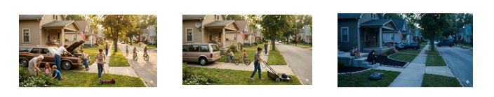
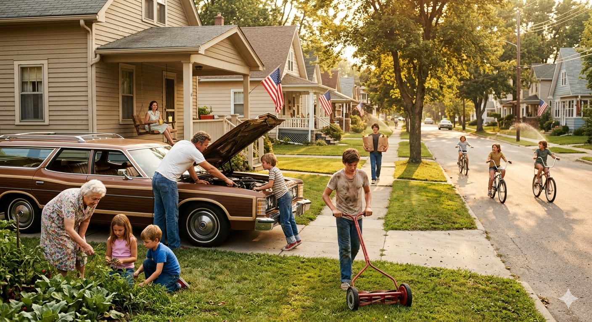
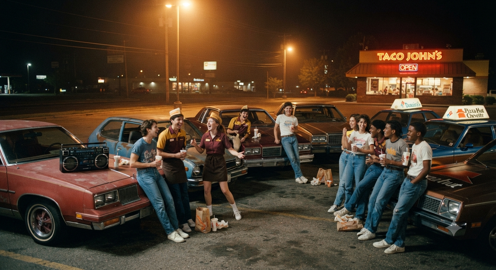
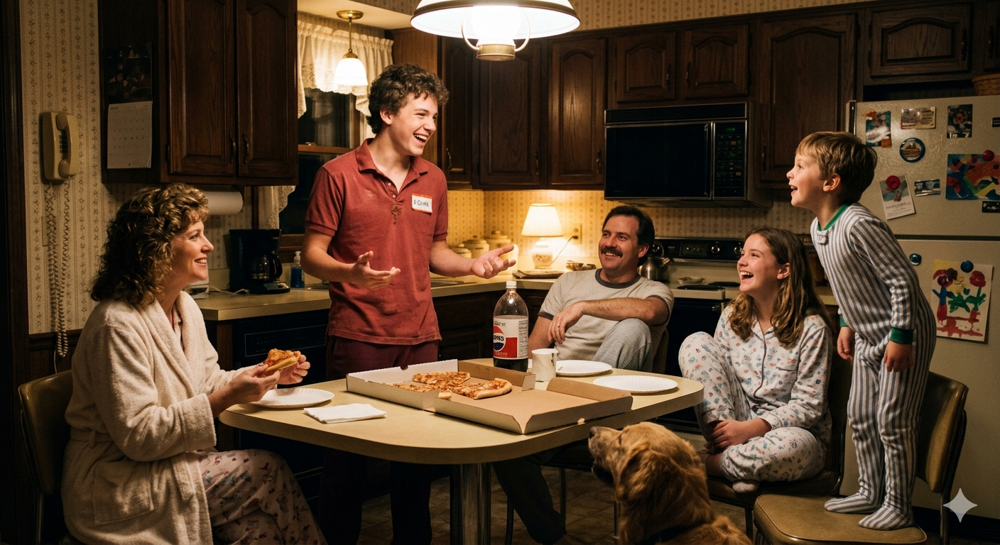
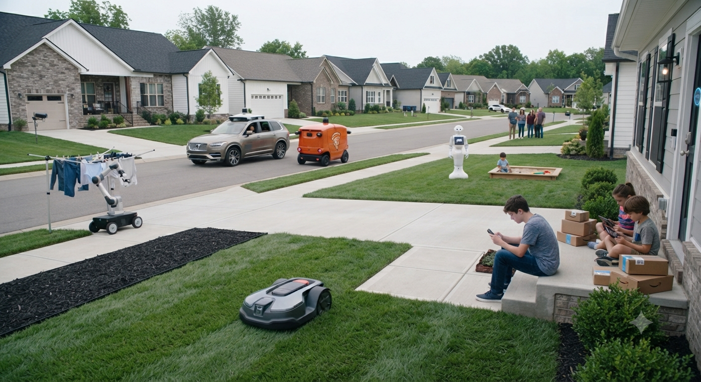
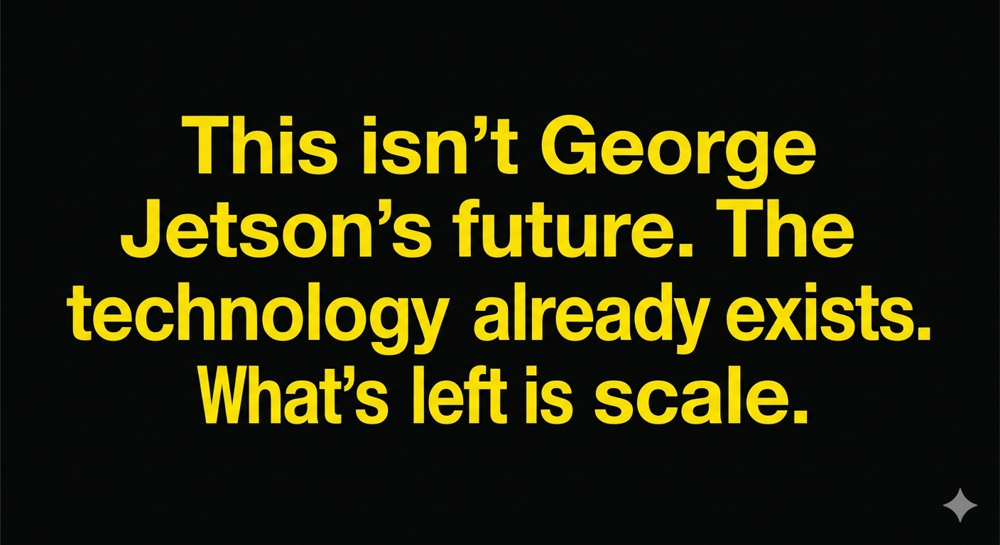

## Before You Begin

Would you invest ten minutes to absorb a novel perspective on what our society has done to alter the trajectory of our children's upbringing — and why so many of them seem lost?

This paper steps back farther than the conversation you've already had about screens and social media. It proposes a foundational shift that predates all of it. Read it slowly. Connect with the stories. Let yourself remember your own past — the things you did as a kid, the jobs you held, the moments when someone noticed and said thank you. Those memories are not nostalgia. They are evidence.

One practical request: read it straight through without interruption. Hit Do Not Disturb. The cognitive flow this paper depends on is fragile — and the investment is worth ten minutes of DND. The difficulty of achieving even that small act of uninterrupted attention is itself a demonstration of everything this paper is about.

Our children — and their future — are worth ten minutes.

# Are We Automating Away Our Children's Path to Satisfying Lives?

We have crossed a threshold. The relentless pursuit of efficiency and labor automation — driven by adults, for adults — has systematically eliminated the one thing children have always needed to become satisfied, grounded, purposeful human beings: the opportunity for recognized contribution. This is not a warning about what artificial intelligence might do someday. This is a description of what we have already done — slowly, reasonably, one convenience at a time, for two or three generations, until the cumulative distance finally lets us see the whole shape of it.

## How Children Actually Become Adults

Humans are not born with identity. They are not born with a sense of purpose or satisfaction. They arrive as potential, and it is the job of parents, community, and society to escort them from that potential to a functioning, grounded adult life.

That escort has always followed a natural pathway. It begins with participation — a child is included in something real. That participation leads to contribution — the child does something that matters. That contribution, when recognized by the adults and community around them, becomes the foundation of identity. The child begins to understand who they are, what they are capable of, and where they fit. That identity produces satisfaction. And that satisfaction generates the curiosity and motivation to participate again, in new domains, at higher levels, across years. That cycle, repeated across a childhood, produces something beyond satisfaction. It produces agency — the felt sense that one is capable of engaging an uncertain world and finding footing in unfamiliar terrain. And agency, accumulated across years of recognized contribution, produces the most valuable human characteristic of all: the motivation to face the unknown. Not to tolerate it. Not to endure it. To face it. That motivation is not a personality trait. It is a developmental outcome. It has been essential to human survival and human progress for a thousand years. It is more essential today than it has ever been. And it is the first thing to disappear when the chain of recognized contribution is broken.

Each turn of that cycle also deposits something specific and irreplaceable — trust extended by adults who believe a child can be relied upon, contact with a community wider than the family, and the unsupervised company of peers. Strip the chain away, and these disappear with it, quietly, even when no one notices they were ever there.

This cycle — participation, contribution, recognition, identity, satisfaction, agency, and the motivation to face the unknown — is not a modern theory. It is how human development has worked across every culture and every era for thousands of years. It is ancient, universal, and until very recently, largely automatic.

Remove recognized contribution from that chain, and the entire mechanism breaks. The child still arrives. The potential is still there. But the pathway is gone. What fills the vacancy is malaise — a low-grade, structureless existence without a felt sense of purpose or forward motion. And into that vacancy, inevitably, flows whatever is available to simulate the feeling of connection and mattering. For this generation, that has been social media. Social media did not create the vacancy. It moved in. And once a generation learns to fill that vacancy with a screen instead of a person, is it any surprise to look around a restaurant and see a table of teenagers together, and yet each one alone — with their phones?

## How We Broke It

No one made a decision to harm children. That is what makes this so difficult to see.

Start somewhere that has nothing to do with artificial intelligence, because the picture is clearer there. In the 1950s, one of the most common teen jobs in America was the full-service gas station attendant — a kid who checked your oil, washed your windshield, made small talk, and took your money before you ever touched the pump yourself. Then someone invented the self-service pump. Within a few years the job was gone — not because anyone decided teenagers shouldn't pump gas, but because it was cheaper and faster not to need them. Nobody mourned the gas station attendant at the time. Why would they? The line moved faster. But something real left with him, and it has been leaving, one job at a time, ever since.

The pathway of recognized contribution has always moved in stages. In the earliest years, it lived inside the home. A child folded laundry, washed dishes, mowed the lawn, watched a younger sibling while the parents worked. Then it expanded just beyond the front door — over to a neighbor's house, or to grandma and grandpa's place to help tend the vegetable garden, pull weeds, earn a little money, and leave knowing they had done something that mattered to someone they loved. These were not chores in the punitive sense. They were real tasks, with real consequences, performed inside real households and real families that needed them done. When they were done, the adults around that child noticed. They said thank you. They trusted the child with more. That child became someone who contributed. That identity was not assigned — it was earned, repeatedly, visibly, in the place they lived.

Then came the teen job, the stage that prepared a child for life beyond the home. For over a century, the teen job has been one of the most recognizable institutions in American life. The newspaper route. The fast food counter. The pizza delivery run through familiar neighborhood streets. These weren't glamorous. They weren't supposed to be. They were the first time a young person showed up somewhere that wasn't home, did something that wasn't optional, got paid, and was seen doing it by the wider world. That transaction — real work, real recognition, real reward — was the bridge between childhood and adulthood. Millions of people reading this sentence held one of those jobs. They remember exactly how it felt.

The teen job was not only an economic transaction. It was where teen social life happened — organized, naturally, around shared work and shared hours: the trust of being handed the car keys and a curfew, the community of regular customers and coworkers who knew your name, the mingling with friends and almost-friends that turned a shift into something closer to a social life. That too is gone.

The newspaper route is gone. Not because someone else is delivering the paper — because the paper itself moved to a screen. We cheered the digital news revolution and forgot entirely about the teenager who used to ride a bike through the neighborhood at six in the morning. Nobody hired a teen to deliver a push notification.

The fast food counter is disappearing. Kiosks took the order. Apps took the transaction. Robots are now building the burrito. The industry that employed more first-time workers than perhaps any other in the last century is systematically removing the human from the equation — and the youngest, least experienced humans go first.

Pizza delivery gave way to Uber Eats and DoorDash, platforms that don't run on teenagers. Babysitting survives — barely — but the pitch for AI-monitored robot childcare is already being made, and it will be sold as safer. It probably will be adopted.

Now remove the tasks from the first stage too. The washing machine handles itself. The dishwasher runs on a schedule. The lawn service comes on Thursdays. Instacart delivers the groceries. DoorDash brings dinner. The younger sibling has an iPad. Grandma and grandpa's vegetable garden is gone — replaced by a grocery delivery subscription neither of them had to ask a grandchild to help with.

Each of these decisions is reasonable. Each one saves time. Each one is a product someone built, sold, and celebrated as progress.

But in the aggregate, across decades, the natural scaffolding of child development was quietly dismantled stage by stage, task by task. The household contribution infrastructure and the teen job economy — the two great engines of recognized contribution for developing humans — were automated away in the name of adult convenience and economic efficiency.

And they are not finished. The remaining opportunities are still being squeezed. The destination, if the current trajectory holds, is zero.

Artificial intelligence is not the beginning of this story. The washing machine was. AI is the latest chapter, and by far the fastest moving one. What took decades before is now happening in years. And this time, there is no next rung of the ladder waiting beneath.

## The Cliff

Everything described so far has been gradual enough to miss. A washing machine here, a kiosk there, three generations spread thin enough that no single year ever felt like the year something broke. That gradualness is ending.

What has happened until now is only the warm-up. AI, on its own, is software — it recommends, it routes, it predicts, it writes. It has been knocking on the door of the physical world but has not yet walked through it. The keyboard and the mouse were how a person reached into a computer. A robot — wheels, fingers, a camera that sees and a body that acts on what it sees — is how AI is about to reach into a house, a yard, a pool, a nursery. That is not a science fiction premise. It is not an Arnold Schwarzenegger movie. It is a delivery drone in China today, a driverless car on American streets today, a lawn already being mowed by a machine in a growing number of neighborhoods today. The pieces are already assembled. What is left is scale, and scale moves fast once trust catches up with evidence — the way it just did, all at once, for the driverless car.

When it arrives at scale, it will not slow the erosion described in this essay. It will finish it. Mowing, laundry, childcare, the last remaining teen job, the last remaining household task — all of it within reach of a machine that does not get tired, does not get distracted, and will be marketed, correctly, as safer. People will not adopt it because they stopped loving their kids. They will adopt it for the same reason they got in the driverless car.

There is no path backward from here. The household tasks are not coming back. The teen jobs are not coming back. And there is no version of this essay that ends by asking anyone to slow the technology down, because that has never once worked and will not start working now.

What is left is the only question that matters: if the old path is closed and we cannot walk back down the mountain we just climbed, where is the new one.

## Why We Can't Simply Stop

The entrepreneurial system is not broken. It is working exactly as designed. It finds inefficiency and eliminates it. It builds products people want, reduces labor costs, and rewards those who do it well. That system has generated extraordinary improvements in human quality of life, and it is not going to stop.

This is not an argument against the washing machine. It is not a call to eliminate Instacart or dismantle AI. The problem was never the pursuit of efficiency itself. The problem is that the pursuit of efficiency operates on one side of a ledger, and no one has been watching the other side.

There was no malicious intent. There was no conspiracy. There was a collective blind spot — a systemic failure to ask a simple question: what does the child lose when the task disappears? Economists didn't ask it. Policymakers didn't ask it. Parents didn't ask it, because each individual decision looked like a gift. The incentive system was never designed to ask it at all.

## Now We Know

The void is real. It is structural. It has been building for decades and accelerating for years. And now, for the first time, we can see it clearly enough to name it.

That changes the question. The question is no longer how do we stop efficiency — we don't, and we shouldn't. The question is how do we intentionally rebuild what efficiency eliminated. How do we design and build the infrastructure that returns recognized contribution opportunities to developing humans — at scale, across domains, across age groups, across communities.

That infrastructure does not yet exist in any organized way. But we now know what it needs to do. It needs to give children real things to do, in real contexts, that matter to real people — and it needs to make sure those children are seen doing them. The shape of that solution is beginning to emerge. The first people who build it well will have done something as important as anything this generation has attempted.

## A Final Observation

Young adults today are choosing not to have children at historic rates. The reasons given are economic, environmental, cultural. All of those are real.

But there may be something else underneath. Satisfied people — people with a clear sense of who they are, what they are capable of, and where they belong — tend to want to bring new life into the world. People without that footing, people still searching for the identity that was never fully formed, tend not to.

If that is true, the declining birth rate is not just a demographic trend. It is a signal. It is what a generation of broken developmental pathways looks like from the outside, thirty years later.

That may not be a coincidence worth ignoring.
