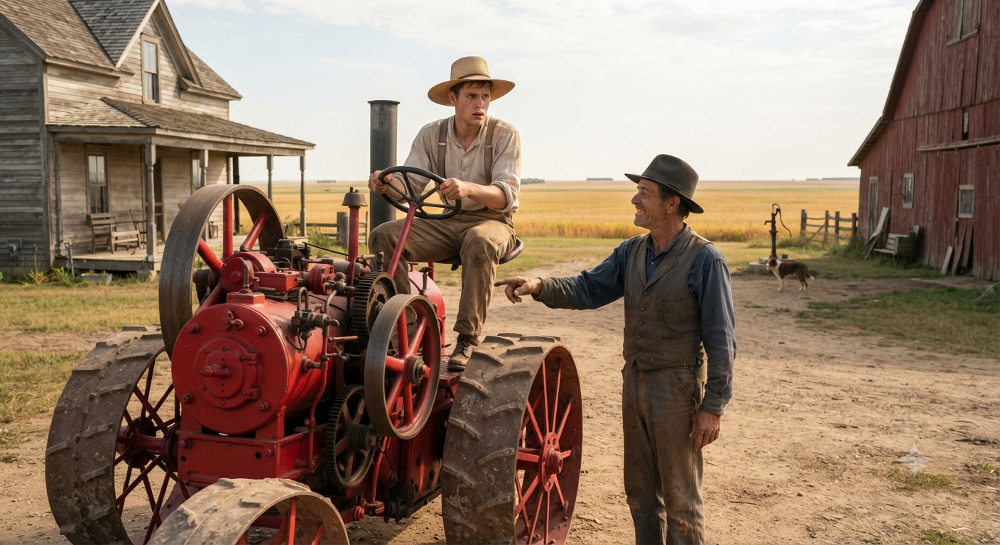

# ADDENDUM — THE TRACTOR AND THE ALGORITHM: WHAT INVISIBLE PREREQUISITE KNOWLEDGE LOOKS LIKE IN THE AGE OF AI

The main essay describes what was taken from young people across two generations — the household tasks, the teen jobs, the recognized contribution opportunities that used to escort a child from potential to identity without anyone designing them that way. This addendum looks at what that loss means specifically in the age of AI — and why the problem is more urgent, and more fixable, than most people realize.

Consider what happened to prototyping. A year ago, learning to prototype meant moving through a sequence of individual tools — each one requiring mastery, each one building a mental model that the next tool assumed you already had. This year, AI replaced nearly the entire tool chain in a single semester. The tools are gone. But so is something else that nobody planned to remove: the learning architecture that lived inside moving through them sequentially. Experts retained their mental models because they built them before AI arrived. Beginners inherited the interface without inheriting the architecture. Tool chains, it turns out, were also learning chains. And AI just collapsed them.

Picture a young farmer in the 1880s. He has farmed his whole life with his hands and a plow horse. He has never seen a motorized machine of any kind. One morning he looks across the field and watches his neighbor do in an hour what takes him three days. He doesn't know what the machine is. He doesn't know what powers it. He has no frame of reference for any of it — only that it works, and it's faster than anything he has ever seen.

The next day he walks out of his house and finds his neighbor standing in his yard with the tractor.

I saw you watching, the neighbor says. Want to try?

The young farmer says yes and climbs up. He grabs the wheel because he saw his neighbor do exactly that yesterday — that much he learned from watching. But the machine doesn't move. The neighbor says go ahead. The young farmer sits there. He doesn't want to admit he doesn't know what to do next. He doesn't want to look foolish in front of a neighbor who makes this look effortless. So he sits. He holds the wheel. He stares at the controls. He waits for something to become obvious that never does.

Finally, quietly, he admits it. I don't know what to do, he says. I don't know how to make it go.

Turn it on, the neighbor says.

Turn it on. The young farmer has never heard those words used that way. Turn what on? What does on mean for a machine? He has no concept that a machine requires ignition. He has no concept of a key, of a gear, of an engine, of fuel. He wants to use the tool. He is sitting on the tool. The tool is right there. But every single step between him and its use requires knowledge he doesn't have and didn't know he was supposed to have — and every question he has to ask feels like an admission of failure rather than a natural part of learning.

The gap between him and the tractor's productivity isn't effort. It isn't ambition. It isn't even courage. It's invisible prerequisite knowledge — knowledge so foundational that the person who has it doesn't even know they have it, and the person who lacks it doesn't know what they're missing or how to ask for it without shame.

That is where a generation of young people sits today with AI. The most powerful productivity tool in human history is running in the field next to them. They can see what it does. They want what it produces. And they are sitting on it, holding the wheel, afraid to admit they don't know where the key is — while everyone who got there first races farther ahead.

This is the pattern that runs through everything described in the main essay. The washing machine didn't just remove a chore. It removed the invisible prerequisite knowledge that traveled inside doing the chore alongside someone who knew how. The teen job didn't just provide a paycheck. It provided the invisible prerequisite knowledge of what it feels like to show up somewhere you're expected, be counted on, and be seen. AI is not doing something new. It is doing the same thing faster and more completely than any tool before it — collapsing learning chains that nobody recognized as learning chains until they were already gone.

And the young people left behind are not lazy. They are not unmotivated. They are sitting on a tractor they cannot start, in front of a neighbor who forgot what it was like to not know where the key was, in a world that is moving faster than any of them were prepared for.

What they need is not another tool. They need someone to sit beside them on the tractor, without judgment, and show them where the key is. They need an environment that treats the unknown not as evidence of failure but as the starting point of every meaningful thing a person ever learned to do. They need the motivation to face the unknown rebuilt — not assumed, not demanded, but carefully, deliberately constructed through recognized contribution, peer support, and the experience of being trusted with something real.

That environment does not yet exist at scale. And its absence is what makes the question that follows the only one worth asking: who builds it, and when do they start?
